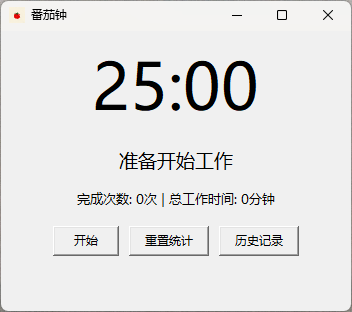
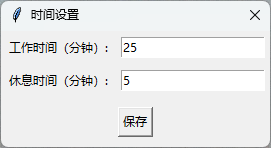
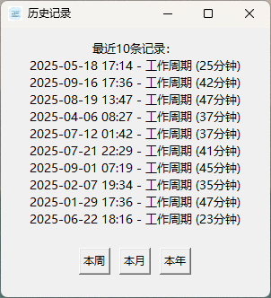
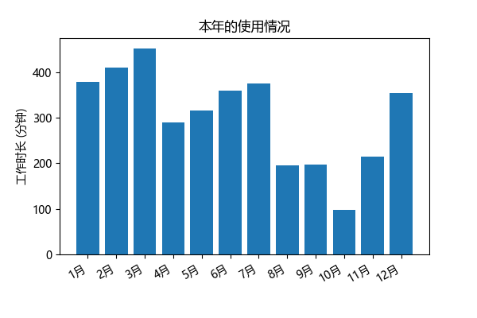

## 番茄钟工具 (Pomodoro Timer)

一个简单易用的番茄钟计时器，帮助你高效工作和休息，提升专注力和生产力。

   

------

### 功能特点

- **工作与休息模式**：25分钟工作，5分钟休息，符合经典的番茄工作法。

   

- **自定义时间**：可根据个人需求调整工作时间和休息时间。
- **统计功能**：记录完成的工作周期和总工作时间。
- **系统托盘支持**：最小化到系统托盘，不占用桌面空间。

   

- **通知提醒**：工作和休息时间结束时，弹出通知并播放提示音。
- **历史记录**：查看最近的工作周期记录同时支持数据可视化。

   
   

------

### 下载与安装

***无需安装，点开即用。***\
在 `release` 下载最新的 `exe` 文件

------

### 使用方法

1. **启动程序**：点击“开始”按钮开始工作计时。
2. **暂停/继续**：点击“暂停”按钮暂停计时，再次点击恢复计时。
3. **休息模式**：工作时间结束后，自动切换到休息模式。
4. **自定义时间**：在托盘菜单中点击设置时间，修改好后点击保存即可
5. **统计信息**：查看完成的工作周期次数和总工作时间。
6. **历史记录**：点击“历史记录”按钮，查看最近的工作周期记录。
7. **数据可视化**：在历史记录界面点击 `本周`/`本月`/`本年` 按钮即可展示对应数据的可视化结果
8. **重置统计**：点击“重置统计”按钮，清除所有统计信息。\
*注：运行 `exe` 文件会自动在同级目录中创建 `pomodoro_stats.json` 文件。推荐将 `exe` 放到文件夹中，然后通过创建快捷方式来使用*

------

### 贡献指南

欢迎任何对项目的贡献！如果你有任何功能建议、改进意见或发现任何问题，请随时提交 [Issue](https://github.com/Zack0-0/PomodoroTimer/issues) 或 [Pull Request](https://github.com/Zack0-0/PomodoroTimer/pulls)。

------

### 许可证

本项目采用MIT License。版权所有 © Zack0-0。